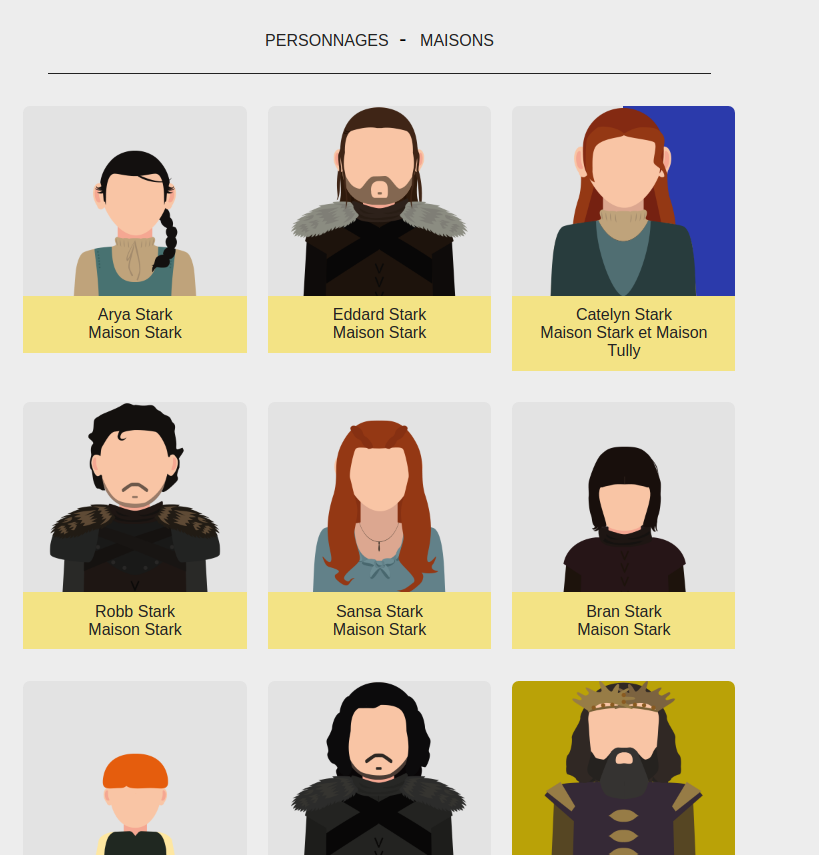
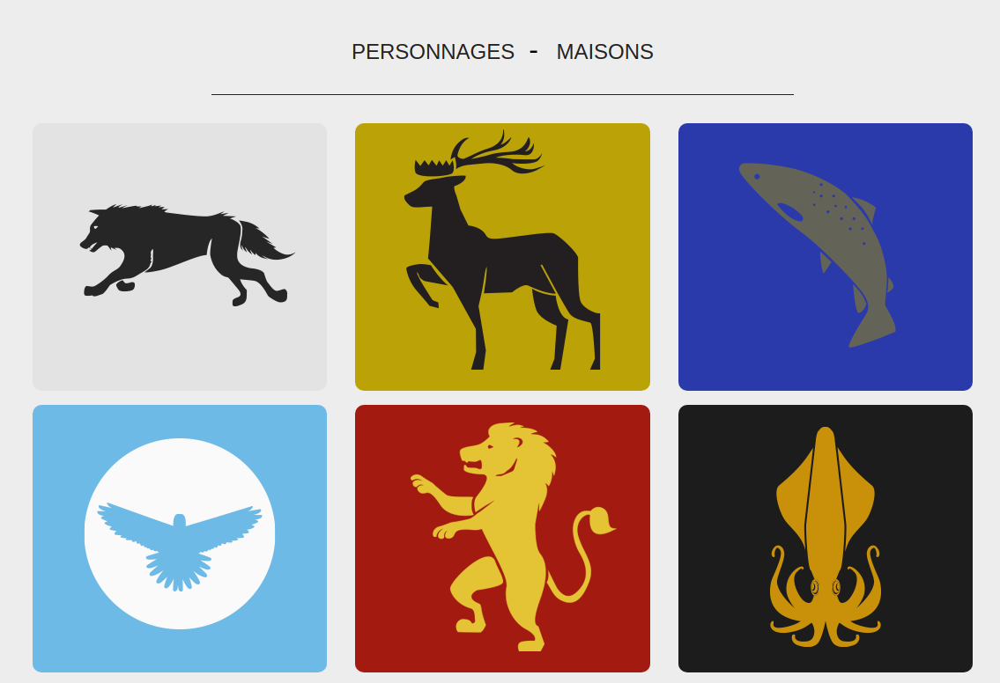
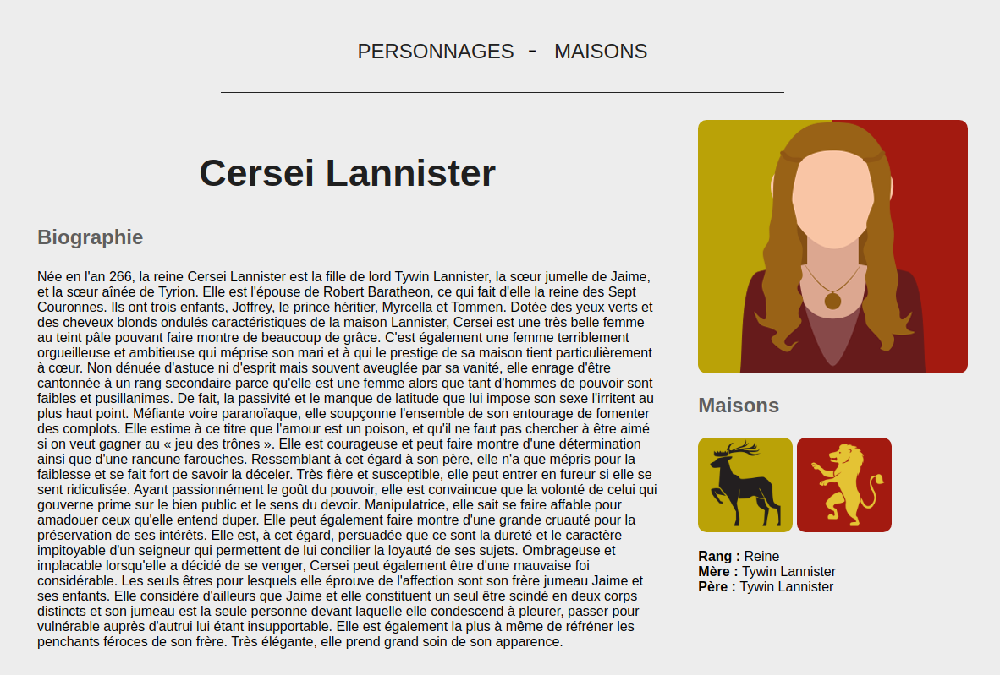
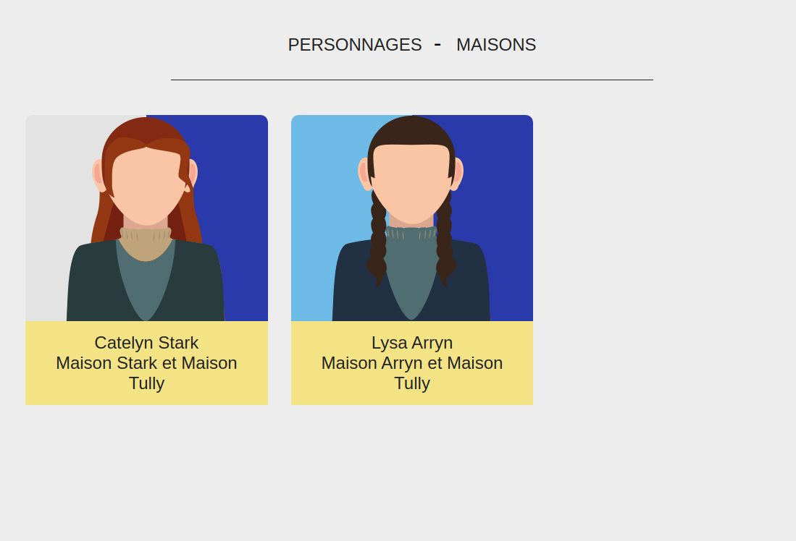

# GAME OF THRONES Laravel

This is my first project in Laravel.

This is a website displaying the main characters and houses in the Game of Thrones TV show.

It allow the users to see the differents main characters with a biographie, their parents and their house(s)

This project uses:

- PHP 8.2.6
- composer version 2.6.6
- laravel 10.10

## Features

- Display the most famous characters/houses in the Game Of Thrones TV show
- Display all characters from a house
- Display a biography of every character
- Navigation on clic : clicking on the houses logo in a character view will redirect you to the houses and conversely

## Project status

### Done

- [x] MVC architecture setup
- [x] Composer and dependencies install
- [x] View creations
- [x] Controller and models creations
- [x] Dynamic search on homepage
- [x] Researched films display
- [x] Dynamic display of a movie details
- [x] Dispatcher add
- [x] navigation on clic
- [x] Dynamic header searchbar
- [x] Error handling

## TODO

- [ ] ...
